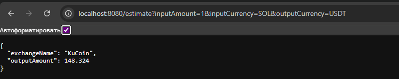

# Peanut.Trade — Multi-Exchange Price Aggregator API

## Overview

**Peanut.Trade** is a professional REST API service written in Go for real-time crypto price aggregation and best-rate estimation across CEX and DEX exchanges. It aggregates data from Binance, KuCoin (REST), Uniswap (The Graph), and Raydium (via Yellowstone gRPC).

---

## Features

- **/estimate** — Find the best exchange and calculate the output amount for a swap.
- **/getRates** — Get prices for a given pair from all supported exchanges.
- **Full details:** API always returns all providers, even if they have no data (with error/status).
- **GET and POST support:** Test easily from browser, Postman, or curl.

---

## Supported Exchanges

- **Binance** (REST, public API)
- **KuCoin** (REST, public API)
- **Uniswap** (The Graph, only supported pools)
- **Raydium** (Solana, Yellowstone gRPC, public node)

---

## Example Usage & Screenshots

### 1. Get rates in browser (SOL/USDT)


### 2. Get rates in browser (ETH/USDT)


### 3. Get rates in browser (BTC/USDT)


### 4. Get best swap (estimate) in browser (ETH/USDT)


### 5. Get best swap (estimate) in browser (SOL/USDT)


### 6. Get best swap (estimate) in browser (BTC/USDT)


### 7. Server logs: real-time price updates and polling


### 8. Uniswap pool explorer error (no data for some pairs)


---

## Example Requests

### Get rates (GET, browser-friendly)
```
http://localhost:8080/getRates?baseCurrency=SOL&quoteCurrency=USDT
```

### Estimate best swap (GET)
```
http://localhost:8080/estimate?inputAmount=1&inputCurrency=ETH&outputCurrency=USDT
```

### POST requests (curl/Postman)
```bash
curl -X POST http://localhost:8080/getRates -H "Content-Type: application/json" -d '{"baseCurrency":"SOL","quoteCurrency":"USDT"}'
curl -X POST http://localhost:8080/estimate -H "Content-Type: application/json" -d '{"inputAmount":1,"inputCurrency":"SOL","outputCurrency":"USDT"}'
```

---

## Response Format

```json
{
  "details": {
    "Binance": {
      "Rate": 149.02,
      "LastUpdate": 1751367931,
      "Error": ""
    },
    "KuCoin": {
      "Rate": 149.056,
      "LastUpdate": 1751367932,
      "Error": ""
    },
    "Raydium": {
      "Rate": 0,
      "LastUpdate": 0,
      "Error": "API not available or no data yet"
    },
    "Uniswap": {
      "Rate": 0,
      "LastUpdate": 1751367932,
      "Error": "unsupported pair for Uniswap: SOL/USDT"
    }
  },
  "rates": [
    {
      "exchangeName": "Binance",
      "rate": 149.02
    },
    {
      "exchangeName": "KuCoin",
      "rate": 149.056
    }
  ]
}
```

---

## Architecture

- **/cmd/peanut-trade** — entry point (main.go)
- **/internal/api** — HTTP handlers (Fiber)
- **/internal/exchange** — providers (Binance, KuCoin, Uniswap, Raydium)
- **/internal/marketdata** — price aggregation and caching service
- **/internal/service** — business logic (Estimate, GetRates)
- **/internal/model** — DTOs
- **/pkg/yellowstone** — Raydium gRPC client
- **/config** — configs

---

## Limitations & Notes

- **Uniswap:**  
  At the time of writing, The Graph and Uniswap's official interface may not return data for some pools (e.g., SOL/USDT). The details field will show an error like `"unsupported pair for Uniswap: ..."` (see screenshot 8).

- **Raydium (Yellowstone):**  
  Price appears only if the public Yellowstone node provides updates for the pool. If no updates — details will show `"API not available or no data yet"`.

- **CEX (Binance, KuCoin):**  
  If the pair is supported, you always get a price. If not — you'll see an error.

- **API always returns all providers** (even if they have no data).

---

## How to Run

1. Clone the repo and go to the `golang` directory.
2. Install dependencies:
   ```bash
   go mod tidy
   ```
3. Start the service:
   ```bash
   go run ./cmd/peanut-trade/main.go
   ```
4. Test via browser, curl, or Postman.

---

## Testing & Coverage

- **Unit tests cover all core components:**
  - Exchange providers (Binance, KuCoin, Uniswap, Raydium) with HTTP/gRPC mocks
  - MarketDataService (aggregation, error handling, thread safety)
  - Service layer (Estimate, GetRates)
  - REST API handlers (Fiber)
- **How to run all tests:**
  - From the `golang` directory, run:
    ```powershell
    go test ./... -v
    ```
  - All tests should pass successfully (see example below):


---

## Extending the Service

- **Add a new exchange:**
  - Implement the `ExchangeProvider` interface in `/internal/exchange`.
  - Register the provider in `main.go` and add to the polling logic.
- **Add a new pair:**
  - Add the pair to the `pairs` array in `main.go`.
  - For DEX, ensure the pool address is known and supported.
- **Add new endpoints:**
  - Add a handler in `/internal/api/handlers.go` and register the route.

---

## TODO / Roadmap

- [ ] Add more DEX/CEX support (plug-and-play via ExchangeProvider).
- [ ] Improve error handling and monitoring.
- [ ] Add authentication (if needed).
- [ ] Redis caching (optional).
- [ ] Unit tests for core logic.

---

## Screenshots

All screenshots referenced above are in the `screenshots/` folder.

---

## Contacts

**Author:**  
[https://github.com/d589f](https://github.com/d589f)

---

**Peanut.Trade — professional price aggregator for DeFi and CEX!** 